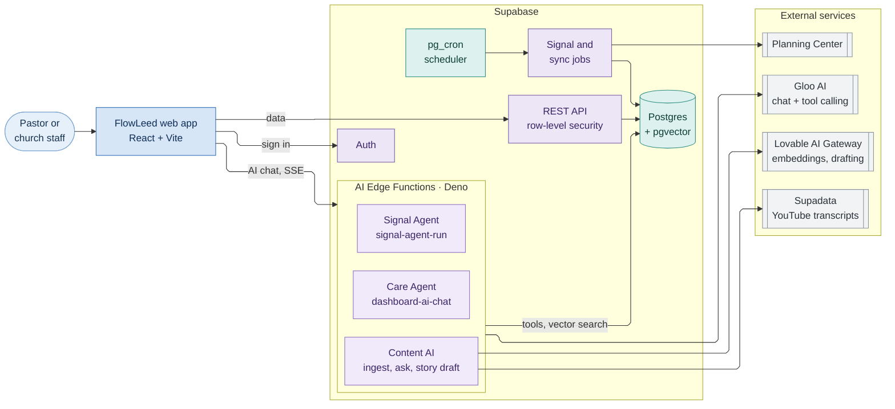

# FlowLeed Care Agent

FlowLeed is a church follow-up and care platform. Churches move people through **Flows** (follow-up journeys such as "New Family Follow-Up"), sync their people, groups and check-ins from Planning Center, and track who is engaged and who is drifting away.

**FlowLeed Care Agent** is the AI layer on top of FlowLeed, powered by **Gloo AI**. This is our entry for the GlooAI Hackathon.

## What FlowLeed Care Agent does

Church staff ask questions in plain language on the FlowLeed dashboard. The agent answers from the church's own data: people, households, Flows, groups, attendance, serving and engagement.

- **Answers care questions with real data.** For example:
  - "Tell me about the Johnson family."
  - "Who is in the New Family Follow-Up Flow?"
  - "Which Fairfield women were in a group earlier this year but aren't in one now?"

  The agent calls tools to look people up instead of guessing. Every person and Flow it mentions is a link to that record.
- **Takes action only after a person confirms.** The agent can add someone to a Flow, add a note to a profile, or record a prayer request.
  - It first shows the exact change in a confirmation card. Nothing is saved until a staff member confirms.
  - Unconfirmed requests expire after 15 minutes.
  - Every step is written to an audit log.
- **Never invents people.** Before an answer reaches the screen, every name in it is checked against the tool results. Any name the model made up is removed.
- **Lets admins choose what it can do.** Tools that only read data are on by default. Tools that change records stay off until an owner or admin turns them on (**Team → AI Tools**).
- **Watches for people who need care.**
  - Signals flag people who stop attending after being regular, stop serving, or sit in the same Flow step for too long.
  - Pastors can build their own signals with AND/OR rules.
  - The Signal Agent reviews the signals a church watches and suggests follow-ups for a person to approve. It never acts on its own.
- **Respects life seasons.**
  - Staff can pause engagement tracking for someone who is sick, has a new baby, is deployed, travelling or grieving, so they aren't flagged as drifting.
  - The season ends automatically when the person attends again.
  - Seasons left open trigger a daily reminder.
- **Turns sermons and testimonies into stories.**
  - Content AI ingests YouTube videos, finds stories by meaning, and answers questions about them.
  - It drafts a testimony story from a video transcript for an editor to review.

## Architecture



How a chat message is handled:

1. The web app sends the message, with the signed-in user's token, to the `dashboard-ai-chat` Edge Function.
2. The function builds a summary of the church (Flows, groups, team) and calls Gloo AI's chat completions API with the tools the church has enabled.
3. When Gloo AI asks for a tool, the function runs it against Postgres, limited to the user's organization, and sends the result back to the model.
4. Tools that change records only create a pending request. The change is saved after the user confirms it in the chat.
5. The final answer is streamed back over server-sent events (SSE). Any person the tools didn't return is removed first.

How the database, storage, cron jobs and secrets are set up, how they were rebuilt from production, and what each environment needs are all in [supabase/README.md](supabase/README.md).

How the app is deployed to staging (GitHub Actions, then Supabase, then Cloudflare), and the GitHub secrets and variables it needs, are in [DEPLOYMENT.md](DEPLOYMENT.md).

## Required environment variables

### Web app (`.env.local` in the project root)

| Variable | Required | Purpose |
|---|---|---|
| `VITE_SUPABASE_URL` | Yes | Supabase API URL. Locally: `http://127.0.0.1:54321`. |
| `VITE_SUPABASE_PUBLISHABLE_KEY` | Yes | Supabase anon (publishable) key, from `supabase status`. |
| `VITE_VAPID_PUBLIC_KEY` | No | Public VAPID key for browser push notifications. Must be the same as the Edge Functions' `VAPID_PUBLIC_KEY`. Without it, turning on push notifications shows an error. |

### Edge Functions (`supabase/functions/.env.local` locally; `supabase secrets set` on a hosted project)

Copy `supabase/functions/.env.example` as a starting point.

| Variable | Required | Purpose |
|---|---|---|
| `GLOO_API_KEY` | Yes | Gloo AI API key, from **API Keys** in Gloo AI Studio. Used by the Care Agent, the Signal Agent, Content AI and AI suggestions. |
| `LOVABLE_API_KEY` | Yes, for Content | Lovable AI Gateway key, for embeddings (semantic search) and the story drafter. |
| `SITE_URL` | Yes | Base URL of the web app, used in email links. Locally: `http://localhost:3000`. |
| `TOKEN_SALT` | Yes | Any long random value. Salts the password-reset and email-verification tokens. |
| `SUPADATA_API_KEY` | No | Fetches YouTube transcripts when ingesting videos into Content. |
| `RESEND_API_KEY` | No | Sends email (invitations, digests, password resets). |
| `PCO_OAUTH_CLIENT_ID`, `PCO_OAUTH_CLIENT_SECRET` | No | Lets a church connect its Planning Center account. |
| `VAPID_PUBLIC_KEY`, `VAPID_PRIVATE_KEY`, `VAPID_SUBJECT` | No | Browser push notifications. |
| `CRON_SECRET` | Yes | Shared secret that the database sends to the Edge Functions it calls (scheduled jobs and push notifications). Locally `local-cron-secret`, which must match the Vault value in `supabase/seed.sql`. See [supabase/README.md](supabase/README.md#secrets-per-environment). |
| `TWILIO_ACCOUNT_SID`, `TWILIO_AUTH_TOKEN` | No | Texting and calling, currently paused. |

You don't set `SUPABASE_URL`, `SUPABASE_ANON_KEY` or `SUPABASE_SERVICE_ROLE_KEY` yourself. The Supabase CLI and hosted Supabase inject them.

## How to run the demo

**You need:**
- Node.js 20 or later
- [Bun](https://bun.sh/) 1.4 or later. `bun.lock` is the project's only lockfile.
- Docker Desktop, running
- The [Supabase CLI](https://supabase.com/docs/guides/local-development/cli/getting-started)
- A Gloo AI API key

### 1. Install and start the stack

```bash
bun install
```

```bash
supabase start
```

`supabase start` runs Postgres, Auth, Storage and Studio in Docker. It applies the migrations in `supabase/migrations/` (the schema, storage buckets and cron jobs) and `supabase/seed.sql` (local Vault secrets). Run `supabase status` to get the API URL and the anon key.

### 2. Add your keys

1. Create `.env.local` in the project root with `VITE_SUPABASE_URL` and `VITE_SUPABASE_PUBLISHABLE_KEY`.
2. Copy `supabase/functions/.env.example` to `supabase/functions/.env.local`.
3. Fill in at least `GLOO_API_KEY`, `LOVABLE_API_KEY`, `SITE_URL` and `TOKEN_SALT`, and set `CRON_SECRET=local-cron-secret`.
4. Check that the AI keys work. This needs [Deno](https://deno.com/), and it never prints a key:
   ```bash
   deno run --allow-net --allow-env --allow-read --config supabase/functions/_shared/deno.json --env-file=supabase/functions/.env.local scripts/check-ai-providers.ts
   ```
   Which feature uses which key, and how to test each one: [supabase/README.md → Testing the AI features](supabase/README.md#testing-the-ai-features).

### 3. Run the Edge Functions and the app (two terminals)

```bash
supabase functions serve --env-file supabase/functions/.env.local
```

```bash
bun run dev
```

The app runs at http://localhost:3000. Supabase Studio is at http://127.0.0.1:54323, and local emails arrive in Mailpit at http://127.0.0.1:54324.

### 4. Walk through the demo

1. **Sign up and create your church.** Email confirmation is off locally.
   - Use an email whose name part isn't a reserved word. For example, `pastor@example.com` works, but `admin@…` fails at sign-up. This is a known issue.
2. **Load the sample data.** Go to **Team** and click **Load sample data**. This fills the church with sample people, Flows and groups.
3. **Ask the Care Agent** on the **Dashboard**, for example:
   - "Give me an overview of our Flows."
   - "Tell me about" one of the sample people.
   - "Find women who were in a group earlier this year but aren't in one now."
4. **Let the agent take actions.** Go to **Team → AI Tools** and turn on **Add a note to a person** and **Create a prayer request**. Then go back to the chat and try:
   - "Add a prayer request for (a sample person): recovering from surgery next week."
   - Review the confirmation card and click **Confirm**.
   - Open the person's profile to see the prayer request.
5. **Run the Signal Agent.** Go to **Signals → Agent**, pick the **Watched signals**, and click **Run agent now**. It suggests follow-ups for you to approve.
6. **Content (optional).** This needs `SUPADATA_API_KEY`.
   - Add a YouTube video under **Content** and ask a question about it.
   - In a story, use **Draft from transcript** to have AI write the story text and quotes from the video.

## What was built during the hackathon

The hackathon window starts September 8, 2026, 30 days before demo day. In that time we made about 580 commits and 31 database migrations.

**Already in place before September 8:**
- the Gloo AI connection (`supabase/functions/_shared/gloo.ts`);
- the FlowLeed AI chat with three read-only tools;
- the Signal Agent;
- Content AI (ingest, semantic search, ask).

Everything below was built during the hackathon.

### Care Agent can now take actions, safely (Sept 15–21)
- Three new tools that change records: `add_people_to_flow`, `create_contact_note` and `create_prayer_request`.
- **Confirm before it acts.**
  - A tool only prepares a pending request, stored in `ai_action_requests` and expiring after 15 minutes.
  - The chat shows a confirmation card with the exact change. The change is saved only after the user confirms.
  - The agent may only say an action happened once the execution result confirms it.
- **Audit trail.** Every action is logged in `ai_tool_audit_logs` when it is prepared, completed or fails.
- **Per-church tool controls.** A new **AI Tools** settings tab (`ai_tool_settings`):
  - read tools are on by default;
  - tools that change records are off until an owner or admin enables them;
  - the system prompt tells the model which tools are disabled, so it can explain why.

### Smarter people lists (Sept 15–16)
- `find_contacts_by_criteria` can now combine these filters:
  - campus and gender;
  - membership in a group during a date window, and not being in any active group now;
  - excluded groups;
  - how long someone has been serving;
  - signals and engagement level.
- The tool reports which criteria it applied and which it couldn't. The agent repeats that to the user instead of quietly answering a different question.

### Guardrails against made-up answers (Sept 16–17)
- **Name check.** Before streaming, every `/contacts/<id>` link in the answer is checked against the tool results (`sanitizePeopleMentions`). Unverified people are removed from lists, or reduced to plain text.
- **Stricter prompt rules.** The system prompt now requires that:
  - counts match the people listed;
  - no names are guessed;
  - the agent asks a clarifying question when a filter doesn't exist.
- **Chat experience.**
  - "Thinking" status messages while tools run.
  - Fixes to confirmation handling.
  - A compact layout for iPad and mobile.
  - A new FlowLeed AI avatar.

### Care signals (Sept 9–15)
- **Custom Signals editor.**
  - Create, edit and delete signals with an AND/OR condition builder and a Logic tab.
  - Settings per church (`org_marker_settings`).
- **Recalculation.** Signals are recalculated by `recompute_contact_markers` and a new `recompute-markers-cron` Edge Function.
- **Detection fixes.** Corrected guest, kids check-in and active-Flow detection.
- **Tests.** Unit tests for `evaluate-custom-signals`.
- **Personal signals.** A staff member can create signals that only they see, listed in a Personal tab.

### Engagement scoring per church (Sept 21–22)
- Each church can tune its own engagement weights (`org_engagement_settings`), or inherit the defaults.
- Changes can be previewed on a balanced sample of people before saving.
- Group attendance is now scored separately from service attendance.

### Life seasons (Sept 21–22)
- **Recording a season.** Mark a season for a person (`contact_life_seasons`): sick or medical, new baby, deployed, travelling, bereavement or other.
  - Their engagement scoring pauses.
  - A banner and medical notice appear on their profile.
- **Automatic end.** A season ends when the person attends again (`end_life_season_on_attendance`).
- **Reminders.** A daily `pg_cron` job (`remind-open-life-seasons`) reminds staff about seasons still open.

### Story Library and AI story drafter (Sept 23–27)
- **Story Library.**
  - Stories (`content_stories`) with a block editor (`content_story_blocks`) and inline preview.
  - Next Steps calls to action (`content_story_cta_defaults`).
  - Public story pages (`get_public_story`).
- **AI story drafter.** A new `content-story-draft` Edge Function turns a video transcript into a draft testimony.
  - Editors can add guidance such as tone, pronouns or focus.
  - The function checks the user is signed in, and is told never to invent facts.

### Platform work the agent depends on (Sept 9 – Oct 1)
- **Security.** Fixed row-level security findings (Sept 17 and 28).
- **Reliability.**
  - A guard and retries for Planning Center sync (Sept 9).
  - Automatic retry for failed text messages (Sept 23).
  - Faster, batched loading of the people list (Sept 15).
- **Local development (Oct 1).**
  - The whole stack runs locally against Supabase in Docker, with Gloo AI credentials kept in a local env file.
  - The Supabase URL and key are read from environment variables, not hard-coded.
- **Edge Functions (Oct 1).**
  - 233 migrations were replaced with a single production schema baseline.
  - Dependencies are pinned per Edge Function with `deno.json`, and every function uses `Deno.serve`.
  - Edge Function calls go through a typed API layer (`src/api/`) with shared request and response models.

## External libraries and APIs

### APIs and services

| Service | Used for |
|---|---|
| [Gloo AI](https://docs.gloo.com) | OpenAI-compatible chat completions with tool calling (model `gloo-google-gemini-3-flash`) on Gloo's guarded endpoint, called with the `openai` SDK and an API key. Powers the Care Agent, the Signal Agent, Content AI answers and analysis, contact suggestions and AI drafts. |
| Lovable AI Gateway | Embeddings (`google/gemini-embedding-001`) for semantic search, and the story drafter. |
| [Supabase](https://supabase.com) | Auth, Postgres, REST API with row-level security, Edge Functions (Deno), Storage, and the Postgres extensions `pgvector`, `pg_cron`, `pg_net` and Vault. |
| [Planning Center](https://developer.planning.center) | Syncs people, groups, check-ins and serving history (OAuth). |
| [Supadata](https://supadata.ai) | YouTube transcripts for Content. |
| [Resend](https://resend.com) | Transactional email: invitations, digests, password resets. |
| Web Push (VAPID) | Browser push notifications. |
| [Twilio](https://www.twilio.com) | Texting and calling (paused for now). |

### Web app

| Library | Used for |
|---|---|
| React 18, Vite 5, TypeScript 5 | App framework and build |
| Tailwind CSS 3, shadcn/ui, Radix UI | Styling and UI components |
| TanStack Query 5 | Data fetching and caching |
| React Router 6 | Routing |
| `@supabase/supabase-js` | Supabase client |
| `react-markdown` | Rendering the agent's answers |
| Recharts | Dashboards and charts |
| dnd-kit | Drag and drop (story editor, form builder) |
| react-hook-form, zod | Forms and validation |
| date-fns, lucide-react, sonner | Dates, icons, toasts |

### Edge Functions (Deno)

| Library | Used for |
|---|---|
| `npm:@supabase/supabase-js@2.117.2` | Database and auth access |
| `npm:openai@7.25.0` | Calling Gloo AI, through `_shared/gloo.ts` |
| `npm:resend@4.0.0` | Sending email |
| `npm:@react-email/components@0.0.22`, `npm:react@18.3.1` | Email templates |
